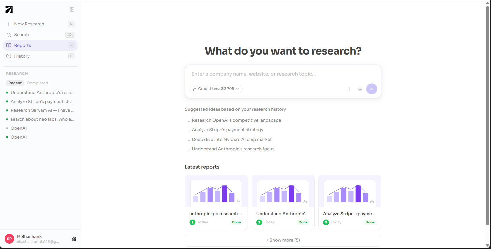
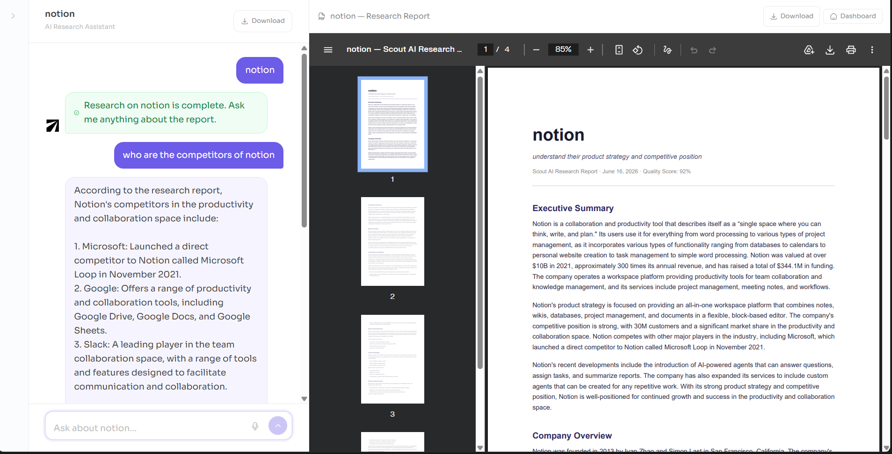

<p align="center">
  
</p>

<p align="center">
  
  
  
  
  
</p>

<p align="center">
  <b>Scout AI</b> is an AI research copilot that researches any company and generates a structured briefing in under 2 minutes, so you walk into every sales or business meeting fully prepared.
</p>

---

**Enter a company name. Scout AI searches the web, analyzes the findings, quality-checks the output, and generates a PDF report. Then ask follow-up questions in chat.**

---

## Screenshots

<p align="center">
  
</p>

<p align="center">
  
</p>

---

## Why Scout AI

1. **Not just a search wrapper.** A 5-node LangGraph workflow plans targeted queries, searches via Exa's neural search API, synthesizes findings with a 70B LLM, runs an automated quality check, and generates a structured PDF — all in a single run.

2. **Quality gate with retry.** If the analysis scores below 0.7 on coverage, specificity, and objective alignment, the workflow loops back and runs a second research pass before generating the report. You always get a complete report.

3. **Chat on the report.** After the report is generated, ask follow-up questions in a chat interface grounded strictly in the report content — no hallucinations from general training data.

---

## How It Works

When you submit a company, Scout AI runs a 5-node LangGraph workflow:

### Workflow Pipeline

```
[Planner] → [Researcher] → [Analyzer] → [Quality Check]
                 ↑                              │
                 │   score < 0.7 (retry)        │  score ≥ 0.7
                 └──────────────────────────────┤
                                                ↓
                                       [Report Generator]
                                                │
                                              END
```

### Node Breakdown

| Node | What It Does |
|------|-------------|
| **Planner** | LLM generates 6 targeted search queries across 6 categories: overview, market, competitors, recent news, financials, technology |
| **Researcher** | Runs all 6 queries against Exa's neural search API in parallel — fetches titles, URLs, highlights, and page content |
| **Analyzer** | LLM synthesizes raw results into an 8-section structured markdown analysis |
| **Quality Check** | LLM scores the analysis on 3 dimensions (0–1). Fails below 0.7, triggering a research retry |
| **Report Generator** | Converts the analysis into a styled PDF using ReportLab and stores it on disk |

### Report Sections

Every report includes: Executive Summary · Company Overview · Products & Services · Market Position · Competitive Landscape · Recent Developments · Financial Signals · Risks & Opportunities

### Real-Time Progress

Progress streams live to the browser via SSE as each node completes. A late-connecting client automatically replays all past events — no missed updates.

---

## How It Compares

|  | **Scout AI** | Manual Google | ChatGPT | Perplexity |
|---|---|---|---|---|
| Structured 8-section report | ✅ | ❌ | Partial | ❌ |
| Automated quality gate | ✅ | ❌ | ❌ | ❌ |
| Live progress tracking | ✅ | ❌ | ❌ | ❌ |
| PDF download | ✅ | ❌ | ❌ | ❌ |
| Chat grounded in report | ✅ | ❌ | ❌ | ❌ |
| Session history | ✅ | ❌ | Partial | ❌ |
| Neural web search | ✅ | Partial | ❌ | ✅ |
| Custom research objective | ✅ | ❌ | ❌ | ❌ |

---

## Setup

### Prerequisites

| Tool | Version |
|------|---------|
| Python | 3.13+ |
| Node.js | 18+ |
| uv | latest (`pip install uv`) |

**API keys needed:**
- [Groq](https://console.groq.com) — LLM inference (free tier works)
- [Exa](https://exa.ai) — neural web search

### 1. Clone

```bash
git clone <repo-url>
cd zylabs
```

### 2. Backend

```bash
cd backend
cp .env.example .env
```

Fill in `.env`:

```env
GROQ_API_KEY=your_groq_key
EXA_API_KEY=your_exa_key
DATABASE_URL=sqlite:///./scout.db
STORAGE_DIR=storage/reports
LOG_LEVEL=INFO
CORS_ORIGINS=["http://localhost:5173"]
```

```bash
uv sync
```

### 3. Frontend

```bash
cd frontend
npm install
```

### 4. Run

Open two terminals:

```bash
# Terminal 1 — backend
cd backend && uv run uvicorn main:app --reload --port 8000

# Terminal 2 — frontend
cd frontend && npm run dev
```

Open `http://localhost:5173`.

---

## API Reference

| Method | Endpoint | Description |
|--------|----------|-------------|
| `POST` | `/api/sessions` | Create research session |
| `GET` | `/api/sessions` | List all sessions |
| `GET` | `/api/sessions/{id}` | Get session |
| `DELETE` | `/api/sessions/{id}` | Delete session |
| `POST` | `/api/sessions/{id}/run` | Start LangGraph workflow |
| `GET` | `/api/sessions/{id}/stream` | SSE — live node progress |
| `GET` | `/api/sessions/{id}/report` | Report as JSON |
| `GET` | `/api/sessions/{id}/report/pdf` | View PDF in browser |
| `GET` | `/api/sessions/{id}/report/download` | Download PDF |
| `POST` | `/api/sessions/{id}/chat` | Send chat message |
| `GET` | `/api/sessions/{id}/chat/history` | Chat history |
| `GET` | `/health` | Health check |

---

## Stack

| Layer | Technology |
|-------|-----------|
| AI Workflow | LangGraph 1.2 (StateGraph, conditional routing) |
| LLM | Groq — Llama 3.3 70B Versatile |
| Web Search | Exa AI (neural semantic search) |
| PDF Generation | ReportLab (pure Python, no system deps) |
| Backend | FastAPI 0.137 + Uvicorn |
| ORM | SQLModel (SQLAlchemy + Pydantic) |
| Database | SQLite (zero-config for local/dev) |
| Streaming | Server-Sent Events (SSE) |
| Frontend | React 19 + Vite 8 + TypeScript |

---

## Project Structure

```
zylabs/
├── backend/
│   ├── main.py                  FastAPI app entry point
│   ├── core/                    config, database, logging
│   ├── api/routes/              sessions, workflow, report, chat
│   ├── graph/                   LangGraph nodes, edges, state, workflow
│   ├── models/                  SQLModel tables
│   ├── services/                llm, exa, pdf, prompts, progress
│   └── storage/reports/         generated PDF output
├── frontend/
│   └── src/
│       ├── components/          Dashboard, ResearchChat, Sidebar, Modal
│       ├── routes/              typed API call wrappers
│       └── lib/                 types, http client, SSE helper
└── docs/
    ├── architecture.md
    ├── engineering-decisions.md
    └── product-improvements.md
```

---

## Roadmap

- Durable workflow execution — LangGraph checkpoint persistence, survive server restarts
- Streaming LLM output — see the report being written token-by-token during analysis
- Inline source citations — every claim linked to an Exa source URL
- Test suite — pytest integration tests for all API routes and graph nodes
- Auth — JWT-based user accounts, session scoping
- CRM export — one-click push to HubSpot / Salesforce
- Company comparison — side-by-side report view for two companies
- Email delivery — send PDF report to inbox on completion

---

## FAQ

<details>
<summary><b>How long does a research run take?</b></summary>

<br/>

Typically 60–120 seconds end-to-end. A progress panel streams each node's status live so you can see exactly what is happening. If quality check triggers a retry, add another 30–60 seconds.

</details>

<details>
<summary><b>What happens if quality check fails?</b></summary>

<br/>

The workflow loops back to the Researcher node and runs a second pass with the same queries. If the score stays below 0.7 after the retry, the workflow exits with an error and the session is marked as failed. There is currently no third retry.

</details>

<details>
<summary><b>Can I ask questions not covered in the report?</b></summary>

<br/>

No — by design. The chat assistant is grounded strictly in the report content. If a question cannot be answered from the report, it responds: *"This information is not covered in the research report."* This prevents hallucination.

</details>

<details>
<summary><b>Where are reports stored?</b></summary>

<br/>

PDFs are saved to `backend/storage/reports/report_{session_id}.pdf`. The path is stored in the database. Sessions and chat history are stored in `backend/scout.db` (SQLite).

</details>

<details>
<summary><b>Is it production-ready?</b></summary>

<br/>

Not yet. It uses SQLite (single writer), in-memory SSE state (lost on restart), and FastAPI BackgroundTasks (no job queue). These are known limitations — see `docs/engineering-decisions.md` for the full picture and the upgrade path.

</details>

<br/>

<p align="center">
  Built for the Zylabs Full Stack AI Engineer Assignment
</p>
